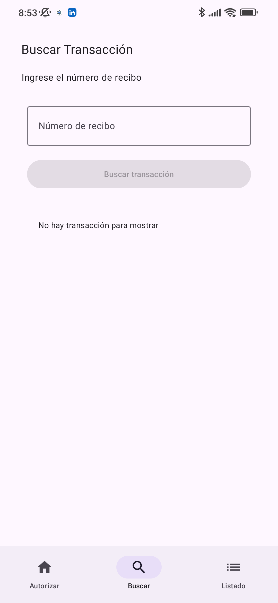
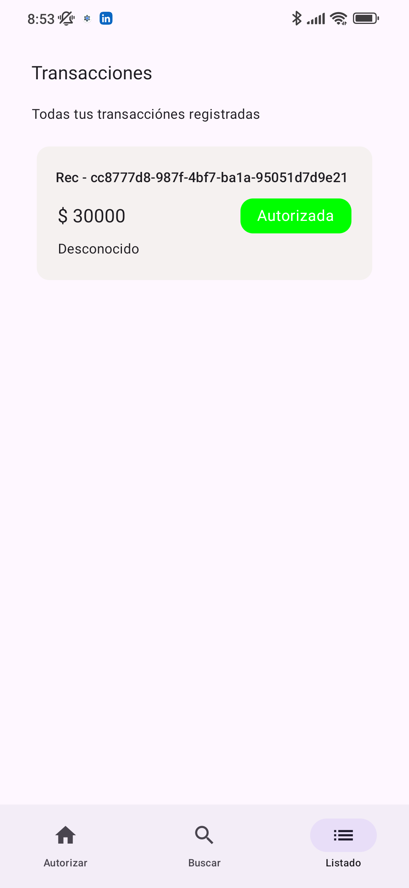

# Prueba Técnica Android – Gestión de Transacciones

Este proyecto corresponde a una **prueba técnica Android**, cuyo objetivo es permitir la **autorización, búsqueda, anulación y visualización de transacciones**, utilizando **Room** como almacenamiento local y una navegación simple entre pantallas.

La aplicación cuenta con **tres pantallas principales**, accesibles mediante un menú inferior (Bottom Navigation).

---

## Pantalla 1: Autorizar Transacción

Esta es la **pantalla inicial de la aplicación**.

Aquí el usuario puede **autorizar y almacenar una nueva transacción**, diligenciando un formulario con los siguientes campos:

- Monto
- Número de tarjeta
- Nombre del titular
- Código de comercio
- ID del terminal

Al presionar el botón **“Autorizar Transacción”**, la información se guarda localmente en la base de datos **Room**.

### Vista – Autorizar Transacción

---

## Pantalla 2: Buscar Transacción

En esta pantalla el usuario puede **buscar una transacción previamente registrada**.

El formulario solicita:

- Número de recibo

La búsqueda se realiza directamente sobre los datos almacenados en **Room**, y si no existe una coincidencia, se muestra un mensaje indicando que no hay transacciones para mostrar, en los detalles de la transacción podras encontrar un boton para anular la transacción.

### Vista – Buscar Transacción

---

## Pantalla 3: Listado de Transacciones

Esta pantalla muestra un **listado de todas las transacciones registradas** en el dispositivo.

Cada transacción incluye información como:

- Número de recibo
- Monto
- Estado de la transacción (por ejemplo: Autorizada)

La información se obtiene directamente desde la base de datos local **Room** y se presenta en una lista optimizada para dispositivos móviles.

### Vista – Listado de Transacciones

---

## Tecnologías utilizadas

- **Kotlin**
- **Jetpack Compose**
- **Room (persistencia local)**
- **MVVM (Model - View - ViewModel)**
- **Navigation Compose**

---

## Funcionalidades principales

- Crear y almacenar transacciones
- Buscar transacciones por número de recibo
- Listar todas las transacciones guardadas
- Persistencia local usando Room
- Navegación clara entre pantallas
- Anulación de transacciones

---

## Ejecución del proyecto

1. Clonar el repositorio
2. Abrir en **Android Studio**
3. Sincronizar dependencias
4. Ejecutar en un emulador o dispositivo físico

---
**Autor:** Miguel Garzón  
**Proyecto:** Prueba Técnica Android
